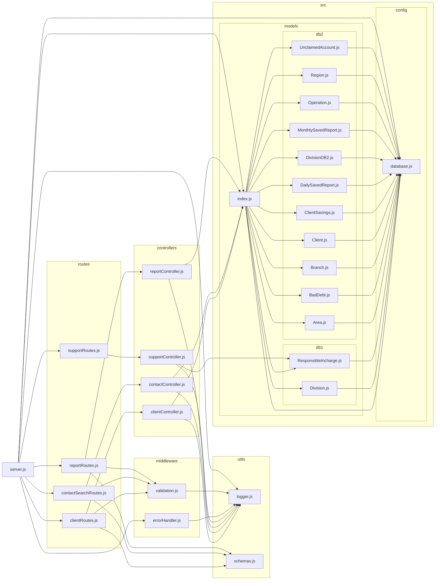

# CAMS Support Portal - Project Architecture

I have set up **Dependency Cruiser** to automatically generate your project diagrams. These diagrams are based on actual code imports and reflect the real-time structure of your application.

## 1. Frontend Architecture (React)
This diagram shows how `App.jsx` connects to your pages, layouts, and services.

```mermaid
flowchart LR

subgraph 0["src"]
1["App.jsx"]
subgraph 2["contexts"]
3["NotificationContext.jsx"]
end
subgraph 4["layouts"]
5["DashboardLayout.jsx"]
end
subgraph 6["theme"]
7["ThemeContext.jsx"]
end
subgraph 8["pages"]
9["ClientTracker.jsx"]
subgraph C["ConsolidatedLogs"]
D["CamsAdjustment.jsx"]
E["CamsReopen.jsx"]
F["DailyCamsConcerns.jsx"]
G["Home.jsx"]
H["Layout.jsx"]
I["StaffAccess.jsx"]
end
J["ContactSearch.jsx"]
K["DailySaveReport.jsx"]
L["DashboardvsFS.jsx"]
M["MonthlySaveReport.jsx"]
N["ResourceDirectory.jsx"]
O["SupportLogs.jsx"]
end
subgraph A["services"]
B["api.js"]
19["mockData.js"]
end
subgraph P["config"]
Q["database.js"]
end
R["main.jsx"]
subgraph S["models"]
subgraph T["db1"]
U["Division.js"]
V["ResponsibleIncharge.js"]
end
subgraph W["db2"]
X["Area.js"]
Y["BadDebt.js"]
Z["Branch.js"]
10["Client.js"]
11["ClientSavings.js"]
12["DailySavedReport.js"]
13["DivisionDB2.js"]
14["MonthlySavedReport.js"]
15["Operation.js"]
16["Region.js"]
17["UnclaimedAccount.js"]
end
18["index.js"]
end
end
1-->3
1-->5
1-->9
1-->D
1-->E
1-->F
1-->G
1-->H
1-->I
1-->J
1-->K
1-->L
1-->M
1-->N
1-->O
1-->7
5-->7
9-->3
9-->B
J-->3
J-->B
K-->3
K-->B
M-->3
M-->B
O-->3
O-->B
R-->1
U-->Q
V-->Q
X-->Q
Y-->Q
Z-->Q
10-->Q
11-->Q
12-->Q
13-->Q
14-->Q
15-->Q
16-->Q
17-->Q
18-->Q
18-->U
18-->V
18-->X
18-->Y
18-->Z
18-->10
18-->11
18-->12
18-->13
18-->14
18-->15
18-->16
18-->17
```



## 2. Backend Architecture (Express)
This diagram shows the flow from `server.js` through routes, controllers, and finally to the database models.



## How to Update Diagrams

I've added **Dependency Cruiser** to your project dependencies. You can regenerate these diagrams manually by running the following commands in your terminal:

### Update Frontend Diagram:
```bash
npx depcruise src --include-only "^src" --no-config --output-type mermaid
```

### Update Backend Diagram:
```bash
npx depcruise server.js controllers routes middleware utils --no-config --exclude "^node_modules" --output-type mermaid
```
